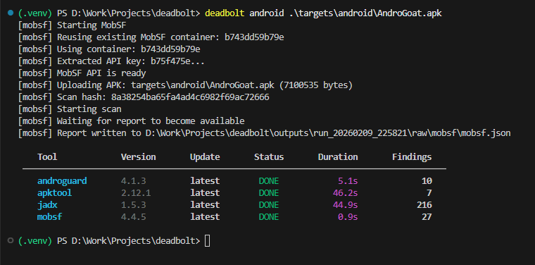

# 🔩 Deadbolt

**Deadbolt** is a lean, professional pentest orchestrator for **AppSec engineers** and **security teams**.

It does not guess.  
It does not over-scan.  
It verifies whether the lock actually holds.

Deadbolt is built for **controlled, auditable reconnaissance and security assessment**, not noisy automation or blind scanning.




## What Deadbolt is (and isn’t)

### Deadbolt **is**

- A **tool orchestrator**, not a monolithic scanner
- Deterministic, resumable, and auditable
- Designed for real-world AppSec and pentest workflows
- Explicit about **data flow** and **tool responsibility**
- Focused on explaining *why* something was found

### Deadbolt is **not**

- A “click-run-everything” scanner
- A brute-force automation framework
- A replacement for human reasoning or validation


## Core capabilities

- Containerized execution (Docker, fully isolated per tool)
- **Hard scope enforcement** (runs refuse to start if scope is violated)
- Deterministic, phase-based pipelines
- Explicit artifact flow between tools
- Resume-safe execution using content hashing
- Live execution visibility (Rich execution table)
- Raw evidence preserved per tool
- Normalized findings schema
- Auditable run metadata (`meta.json`)
- Tool version detection and update awareness
- HTML report generation
- Multi-domain support:
  - 🌐 Web
  - 🤖 Android (APK)
  - 🍎 iOS (IPA)

## Execution model

### Web pipeline

```
Discovery → Enumeration → Vulnerability
```

Artifacts flow explicitly:

```
targets → assets → paths → findings
```

### Mobile pipelines

- **Android**: Static analysis (apktool, androguard, jadx, MobSF)
- **iOS**: Static analysis (MobSF)

Each tool:

- Declares what it consumes
- Declares what it produces
- Runs in isolation
- Emits normalized findings

## Supported tooling

### Web — Discovery

- **subfinder** – subdomain discovery  
- **dnsx** – DNS resolution  
- **httpx** – HTTP(S) validation & classification  

### Web — Enumeration

- **gau** – historical URL discovery  
- **waybackurls** – archive-based endpoint recovery  
- **katana** – crawler-based surface expansion  
- **hakrawler** – HTML link extraction  
- **ffuf** – endpoint discovery via fuzzing  
- **httpx (paths mode)** – path validation & enrichment  

### Web — Input & API

- **paramspider** – parameter discovery  
- **graphql-cop** – GraphQL endpoint analysis  

### Web — Vulnerability

- **nuclei** – template-based vulnerability detection  

### Mobile

- **apktool** – Android resource and manifest decoding for declared attack surface and configuration analysis  
- **androguard** – Semantic Android analysis (permissions, signing, exported components, application flags)  
- **jadx** – Dalvik bytecode decompilation for code-level inspection and hardcoded secret discovery  
- **MobSF** – Correlated Android & iOS security analysis combining manifest, code, crypto, and network signals

## Requirements

- Python **3.10+**
- Docker Desktop (WSL2 recommended on Windows)
- Git

## Clone the repository

```bash
git clone https://github.com/rdSoftInc/deadbolt.git
cd deadbolt
```

## Python environment

```bash
python -m venv .venv
source .venv/bin/activate
```

Install Deadbolt:

```bash
python -m pip install --upgrade pip
python -m pip install -e .
```

## Build scanner images (required)

Deadbolt executes each tool inside an isolated Docker container.  
Images must be built **once** before running scans.

```bash
docker build -t deadbolt-subfinder docker/subfinder
docker build -t deadbolt-dnsx docker/dnsx
docker build -t deadbolt-httpx docker/httpx
docker build -t deadbolt-gau docker/gau
docker build -t deadbolt-waybackurls docker/waybackurls
docker build -t deadbolt-katana docker/katana
docker build -t deadbolt-hakrawler docker/hakrawler
docker build -t deadbolt-ffuf docker/ffuf
docker build -t deadbolt-paramspider docker/paramspider
docker build -t deadbolt-graphql-cop docker/graphql-cop
docker build -t deadbolt-nuclei docker/nuclei
docker build -t deadbolt-jadx docker/jadx
docker build -t deadbolt-apktool docker/apktool
docker build -t deadbolt-androguard docker/androguard
```

## MobSF setup (manual, one-time)

Deadbolt uses the **official MobSF Docker image** for Android and iOS analysis.
This image is **not built locally** and must be pulled manually once.

### Pull MobSF image

```bash
docker pull opensecurity/mobile-security-framework-mobsf:latest
```

Verify image is available

```bash
docker images opensecurity/mobile-security-framework-mobsf
```

Deadbolt will automatically:

- Start the MobSF container when required
- Reuse an existing running MobSF container if present
- Extract the MobSF API key from container logs
- Wait for the MobSF API to become ready before scanning

No additional MobSF configuration is required beyond pulling the image.

## Targets & scope

### Scope configuration (mandatory)

Define scope in `scope.yaml`:

```yaml
allow:
  - example.com
  - postman-echo.com

deny:
  - google.com
```

Runs **fail fast** if scope is violated.

## Running scans

### Web

```bash
deadbolt web targets/web/lab.txt
```

### Android

```bash
deadbolt android targets/android/AndroGoat.apk
```

### iOS

```bash
deadbolt ios targets/ios/app.ipa
```

## Output structure

```text
outputs/run_YYYYMMDD_HHMMSS/
├─ meta.json
├─ state.json
├─ report.html
├─ raw/
├─ work/
└─ normalized/
```

## Philosophy

Deadbolt prioritizes:

- Correctness
- Control
- Auditability

Every result is traceable to its origin.


## License

Deadbolt is released under the **MIT License**.

© 2026 Rolstan Robert D'souza
