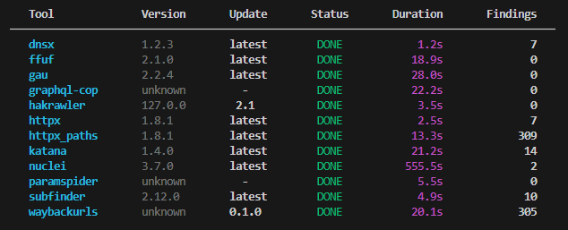
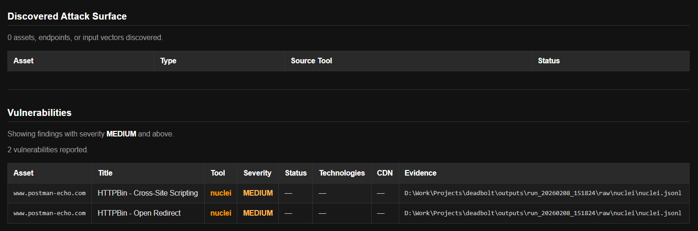

# 🔩 Deadbolt

Deadbolt is a lean, professional pentest orchestrator for **AppSec engineers**.

It does not guess.  
It does not over-scan.  
It verifies whether the lock actually holds.

Deadbolt is designed for **controlled, auditable reconnaissance and vulnerability assessment**, not noisy automation.



## What Deadbolt is (and isn’t)

Deadbolt is:

- An orchestrator, not a monolithic scanner
- Deterministic and resumable
- Designed for real corporate pentests and AppSec workflows
- Built to explain *why* something was found, not just *that* it was found

Deadbolt is **not**:

- A “click-run-everything” scanner
- A replacement for human reasoning
- A brute-force automation framework

## Core features

- Containerized scanner execution (Docker, fully isolated)
- **Hard scope enforcement** (runs refuse to start if scope is violated)
- Deterministic multi-phase pipeline:
  - Discovery → Enumeration → Vulnerability
- Explicit data flow between tools (assets → paths → findings)
- Resume-safe execution with hashing
- Observable execution with live status table
- Raw evidence preserved per tool
- Normalized findings schema
- Auditable run metadata (`meta.json`)
- Tool version detection + update awareness
- HTML report generation

## Supported tooling

### Discovery

- subfinder – subdomain discovery
- dnsx – DNS resolution / refinement
- httpx – HTTP(S) validation & classification

### Enumeration

- gau – historical URL discovery
- waybackurls – archive-based endpoint recovery
- katana – crawler-based surface expansion
- hakrawler – HTML link extraction
- ffuf – endpoint discovery via fuzzing
- httpx (paths mode) – path validation & enrichment

### Input & API 

- paramspider – parameter discovery
- graphql-cop – GraphQL endpoint analysis

### Vulnerability

- nuclei – template-based vulnerability detection


## Requirements

- Python 3.10+
- Docker Desktop (WSL2 on Windows recommended)
- Git


## Clone the repository

```bash
git clone https://github.com/your-org/deadbolt.git
cd deadbolt
```


## Python environment

```bash
python -m venv .venv
```

Activate:

```bash
source .venv/bin/activate
```

## Build scanner images (required)

Deadbolt executes each scanner in an isolated Docker container.

Before running a scan, the corresponding tool images must exist locally.
This is a **one-time setup** unless tools are updated.

Build images using the provided Dockerfiles:

```bash
docker build -t deadbolt-subfinder docker/subfinder
docker build -t deadbolt-dnsx docker/dnsx
docker build -t deadbolt-httpx docker/httpx
docker build -t deadbolt-gau docker/gau
docker build -t deadbolt-waybackurls docker/waybackurls
docker build -t deadbolt-katana docker/katana
docker build -t deadbolt-hakrawler docker/hakrawler
docker build -t deadbolt-ffuf docker/ffuf
docker build -t deadbolt-paramspider docker/paramspider
docker build -t deadbolt-graphql-cop docker/graphql-cop
docker build -t deadbolt-nuclei docker/nuclei
```

Install:

```bash
python -m pip install --upgrade pip
python -m pip install -e .
```

## Configure scope (mandatory)

In `scope.yaml`.

```yaml
allow:
  - example.com
  - postman-echo.com

deny:
  - google.com
```

## Run

```bash
deadbolt run targets/lab.txt
```

## Output structure

```text
outputs/run_YYYYMMDD_HHMMSS/
├─ meta.json
├─ state.json
├─ report.html
├─ raw/
├─ work/
└─ normalized/
```

## Report




## Philosophy

Deadbolt prioritizes:

- Correctness
- Auditability
- Control

Every result is traceable to its origin.

## License

Deadbolt is released under the **MIT License**.

You are free to use, modify, and distribute this project — including for
commercial purposes — provided that proper credit is given and the license
is included.

© 2026 Rolstan Robert D'souza